# Requirements
Before you deploy, you must have the following in place:
*  [AWS Account](https://aws.amazon.com/account/) 
*  [GitHub Account](https://github.com/) 
*  [Node 10 or greater](https://nodejs.org/en/download/) 
*  [Amplify CLI 4.13.1 or greater installed and configured](https://aws-amplify.github.io/docs/cli-toolchain/quickstart#quickstart) 
*  Please create a new Google Maps API Key by following the instructions here: https://developers.google.com/maps/documentation/javascript/get-api-key
   
   Please navigate to your project on the [Google Cloud Platform Console](https://console.cloud.google.com/). Then click on the top left menu button and select **APIs and Services**. Click on the **+ ENABLE APIS AND SERVICES** button at the top of the page. 
   Then search for and enable the following APIs:
      - Maps Javascript API
      - Places API


# Step 1: Front-end Deployment
In this step we will use the Amplify console to deploy and build the front-end application automatically. 

[](https://console.aws.amazon.com/amplify/home#/deploy?repo=https://github.com/UBC-CIC/Mobile_Health_Monitoring_Platform)

1. **1-click deployment** button above. Make sure to start the deployment before continuing. 
2. Go to the [Amplify Console](https://console.aws.amazon.com/amplify/home).
3. Select the **MHMP** app.
4. Wait until **Provision, Build, Deploy and Verify** are all green. 
5. Click on the **Backend environments** tab.
6. Click on **File storage**.
7. Copy the bucket name Amplify created.  You will need this information for setting the environemnt variables in the next step.

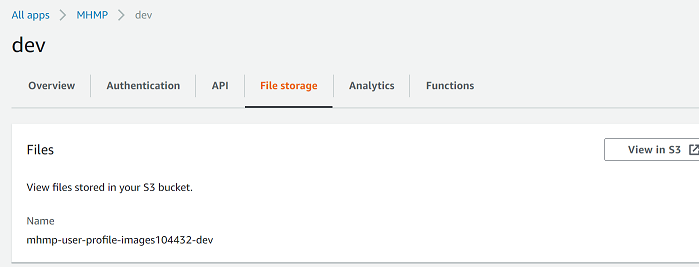

8. In the left-hand menu under *App Settings*, click on **Environment Variables** then **Manage variables**.

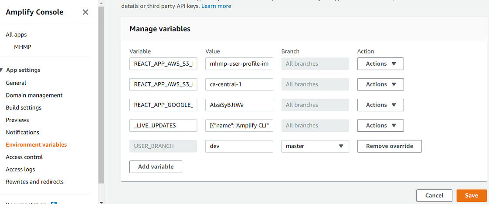


9. Please add the following environment variables:
   ```javascript
   Variable: REACT_APP_AWS_S3_BUCKET        Value: <Name Of The S3 Bucket You Noted Down In The Previous Step>
   Variable: REACT_APP_AWS_S3_REGION        Value: ca-central-1
   Variable: REACT_APP_GOOGLE_MAPS_API_KEY  Value: <The Google Maps API Key You Created Earlier>
   ```
10. Click **Save**.

---

# Step 2: Kinesis Data Stream and Firehose Deployment
## 2.1: Creating the Kinesis Data Stream
Data received from the wearable devices is direct through a Kinesis Data Stream. From there, a copy of the data is pushed through Kinesis Firehose for long-term storage in an S3 based data lake for future analysis. Additionally, the data in the Kinesis Data Stream triggers a Lambda function (we will create this in a later step) that will process the data.

1. Navigate to the Amazon Kinesis Service page in the AWS Console. In the left-hand menu, select **Data streams**.


2. Choose a name for your data stream. In the *Number of open shards* field, type "1". Click **Create data stream**.
3. Next, on your Data Stream's page, select the *Configuration* tab then scroll down to the *Encryption* section. Click **Edit** in the *Encryption* section.

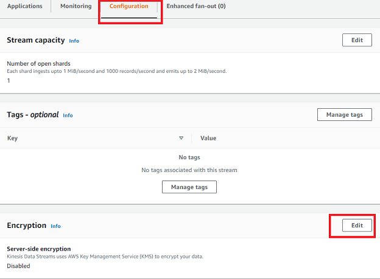

4. Select **Enable server-side encryption**, then choose the **Use AWS managed CMK** option. Click **Save changes**.

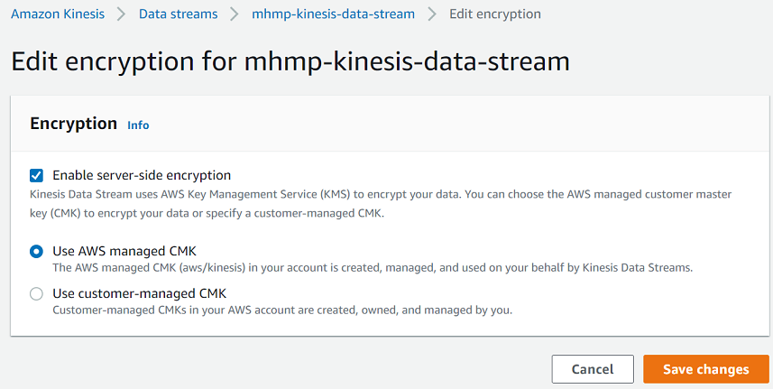


## 2.2: Creating the Kinesis Data Firehose
This service takes data from the Kinesis Data Stream and 

1. Go to the S3 service page in the AWS Console and click **Create bucket**. We will create a new S3 bucket that will hold all our saved data from Firehose.
2. Choose a descriptive name for your bucket. Select **Canada (Central) ca-central-1** in the *Region* dropdown. Under *Bucket settings for Block Public Access*, select the **Block all public access** option.

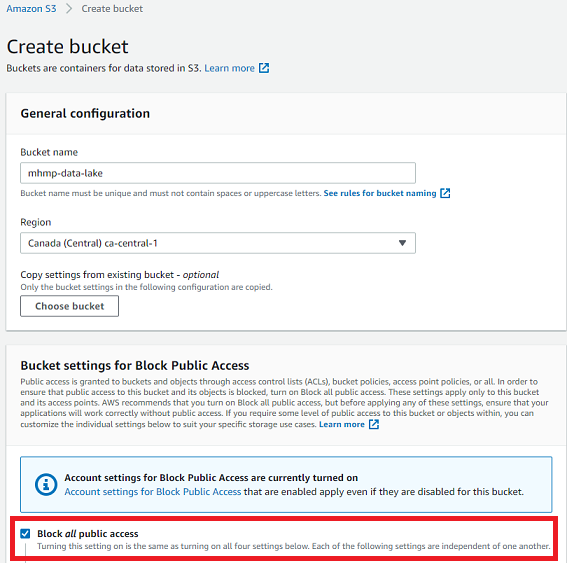

3. In the *Default encryption* section, choose **Enable** under the *Server-side encryption* field. Under the *Encryption key type* field, select the **Amazon S3 key (SSE-S3)** option.

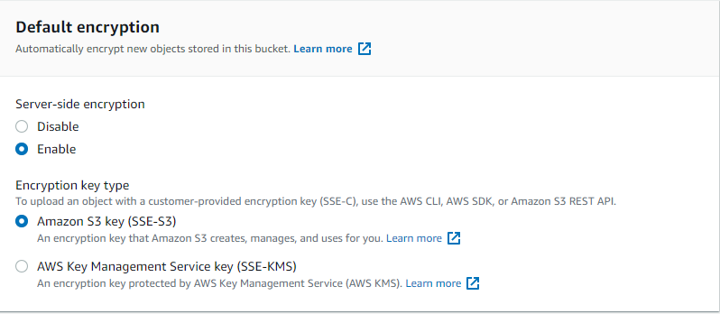

4. Click **Create bucket**.
5. Now navigate to the AWS Glue service page in the AWS Console. Select **Databases** from the left-hand menu, then click **Add database**. In the popup, choose a name then click **Create**.
6. Now click on your newly created database from the list in the *Databases* page. Next, click on **Tables in ...** (replace "..." with your database name).

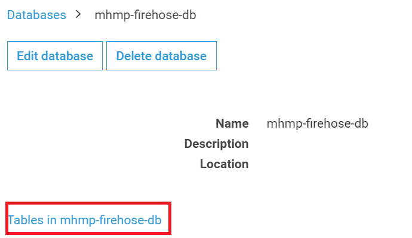

7. Next, from the *Add tables* dropdown, select **Add table manually**. 

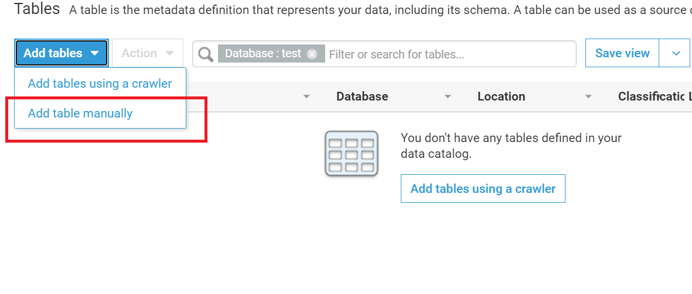

8. Enter a name, then from the *Database* dropdown, select the database you created in step 5 above. Click **Next**.
9. Under the *Select the type of source* field, select the **S3** option. Under the *Data is located in* field, select **Specified path in my account** then click on the folder button to browse your list of S3 buckets. Select the name of the S3 bucket you created in step 4 above. Then click **Select**, followed by **Next**.

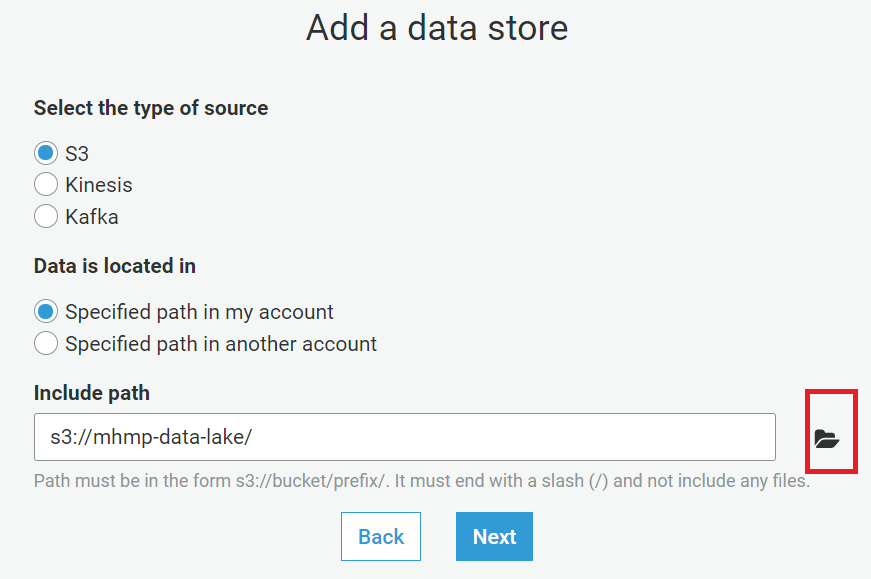

10. Next, on the *Choose a data format* page, under the *Classification* field, select **Parquet**. Click **Next**.
11. Next, on the *Schema* page, click **Add column** to add new columns. Add the following columns then click **Next**:
```javascript
   Column name: deviceid      Data type: string
   Column name: deviceos      Data type: string
   Column name: time          Data type: timestamp
   Column name: heart_rate    Data type: int
   Column name: latitude      Data type: string
   Column name: longitude      Data type: string
```
12. Click **Finish**. 
13. Now navigate to the AWS Kinesis service page in the AWS Console. In the left-hand menu, select **Data Firehose**. Then, click **Create delivery stream**.
14. Choose a name. In the *Choose a source* section, under the *Source* field, select **Kinesis Data Stream**. From the Kinesis data stream dropdown menu that appears, select the data stream you created in step **2.1** above. Click **Next**.


15. On the *Process records* step, under the *Convert record format* section, select **Enable** for *Record format conversion*, then choose **Apache Parquet** as the *Output format*. Next, from the *AWS Glue region* dropdown, select **Canada (Central)**. From the *AWS Glue database* dropdown select the databse you created in step **5** above. From the *AWS Glue table* dropdown, select the table you created in step **7** above. Under the *AWS Glue table version* drowpdown, select **Latest**. Now click **Next**.

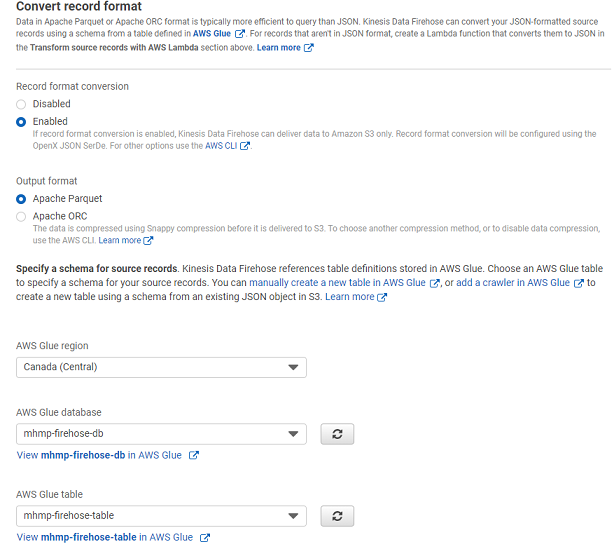

16. On the *Choose a destination* step, select **Amazon S3**. Under the *S3 destination* section, choose the S3 bucket you created in step **4** above from the dropdown. Click **Next**.
17. On the *Configure settings* step, in the *S3 compression and encryption* section, select **Enabled** for the *S3 encryption* field. For the *KMS master key* field, select **(Default)aws/s3**. Click **Next**.
18. Review your selections then click **Create delivery stream**.

---

# Step 3: Lambda Functions Deployment
## 3.1: Creating the Layer
When data is sent from a wearable device to the AWS IoT Core, it gets sent through the Kinesis Data Stream which then triggers a Lambda function for data processing. The Layer file contains the dependencies needed for all the Lambda functions. 

📓 **Note**: If you haven’t cloned the repo yet, the following steps require the files to be saved locally in your computer.

1. In the AWS Console, navigate to the AWS Lambda Services page, then click **Layers** under *Additional resources* in the left-hand menu.

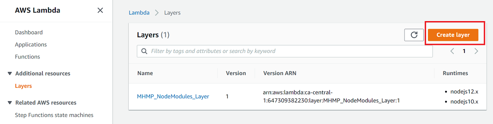

2. Click on **Create Layer** and fill out the required fields. Select the "Upload a .zip file" option. Upload the "nodejs.zip" file located at the */backend/LambdaLayers/MHMP_NodeModules_Layer* folder of the MHMP project. This zip file contains the node modules that are required for the Lambda functions we will create in the following steps. Finally, in the *Compatible runtimes* field, select "Node.js 12.x" and "Node.js 10.x". 

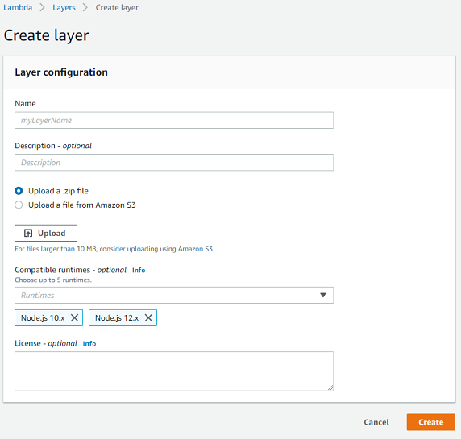

3. Click **Create**.

## 3.2: Creating the Lambda Functions
We will create three different Lambda functions. One will process the data in our Kinesis Data Stream and check for geofence/location anomalies, one will run every five minutes and check for heart rate anomalies, and another function will run hourly to check the device activity.

---

### A. Create a Lambda Role

1. In the AWS Console, naviagte to the IAM Services page.
2. In the left-hand menu, click **Roles** located under the *Access management* tab.
3. Click **Create role**.
4. Under *Select type of trusted entity*, choose **AWS Service**. Under *Choose a use case*, select **Lambda**. Click **Next: Permissions**.
5. In the Search field, type "AWSLambdaKinesis" then select the **AWSLambdaKinesisExecutionRole** policy option. Click **Next: Tags** then **Next: Review**.

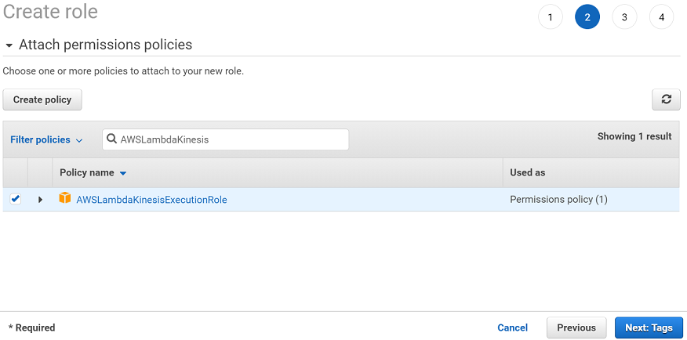

6. Choose a *Role name* then click **Create role**.
7. In the *Roles* page, search for your newly created role and click on it.
8. In the *Permissions* tab, click **Add inline policy**.

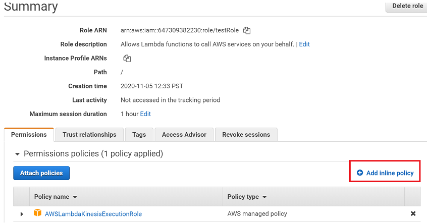

9. In the *Visual editor* tab, click on **Choose a service**, then in the search field, type "DynamoDB" then click the *DynamoDB* option.
10. In the *Actions* section, under *Manual actions*, select the "All DynamoDB actions" option.
11. In the *Resources* section, select the **Specific** option. Then select the "Any in this account" option for all fields.

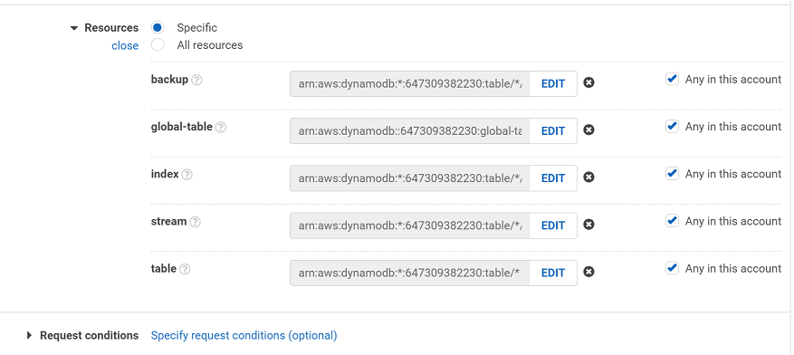

12. Click **Review policy**. Select a name for the policy then click **Create Policy**.
13. Now, in the *Permissions* tab of the role, click **Add inline policy** to add another policy.
14. In the *Visual editor* tab, click **Choose a Service**, then search for *AppSync*. Click on **AppSync**.
15. In the *Actions* section, under *Access Level*, select the **List**, and **Read** options. Under the *Write* option, select the **GraphQL** option.

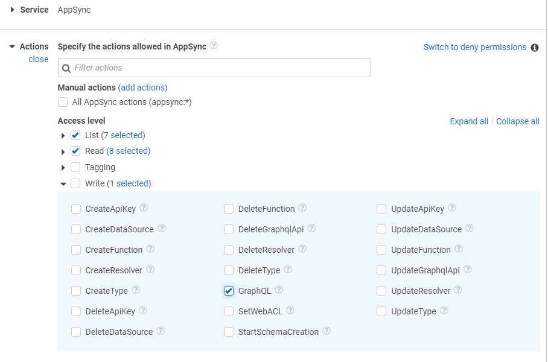

16. In the *Resources* section, select the **Specific** option, then select the "Any in this account" option for all fields.
72. Click **Review policy**. Select a name for the policy then click **Create Policy**.

---

### B. Creating a Data Processing Lambda Function

1. In the Lambda Services page of the AWS Console, click on the **Create Function** button.
2. Select the **Author from scratch** option. Choose a Function name. Select *Node.js 12.x* as the Runtime. Expand the *Change default execution role* section. Select the **Use an existing role** option, then under *Existing role*, select the role you created in the previous section **(3.2 A)***.  

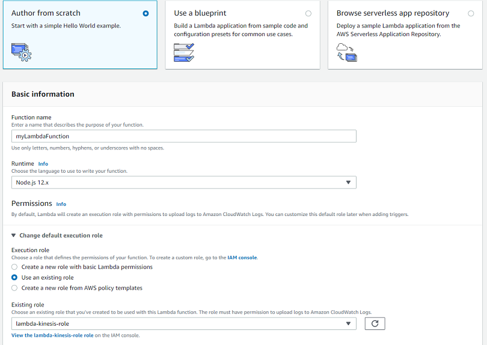

3. Click **Create function**.

4. In your Lambda function's page, under the *Configuration* tab, in the *Designer* section, click on the **Layers** image. Scroll down to the *Layers* section, then click **Add a layer**. 

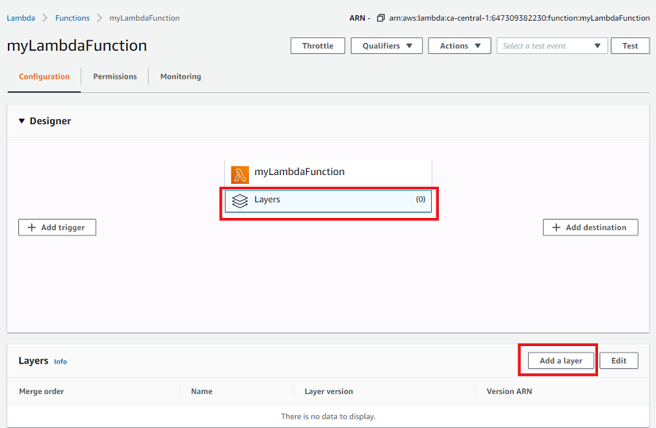

5. Click the **Custom layers** option, then select the layer you created in step 3.1 from the dropdown. Select the "1" option under the *Version* dropdown.

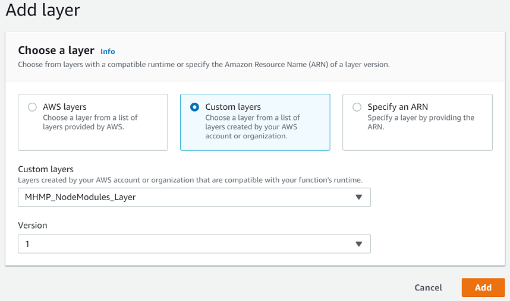

6. Click **Add**.

7. Next, from your Lambda function's page, in the *Designer* section, click the **Add trigger** button. In the dropdown, select **Kinesis**. Under *Kinesis stream*, select the Kinesis Data Stream that you created in Part 2 of this guide. Expand the *Additional settings* sections. Set *Retry attempts* to 1. Set *Maximum record age* to 21,600 seconds (6 hours). Select the **Enable trigger** option. click **Add**. 

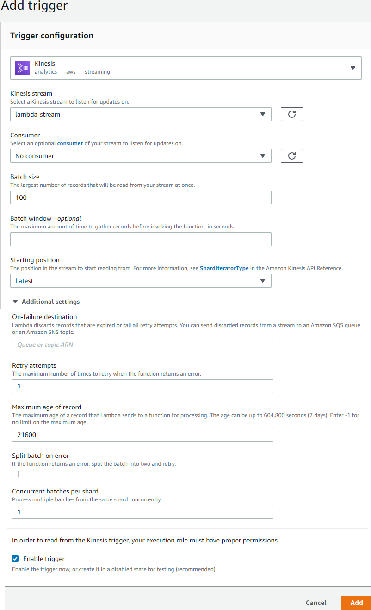

8. From your Lambda function's page, scroll down to the *Basic settings* section and select **Edit**.
9. Increase the *Timeout* from 3 seconds to 1 minute. Click **Save**.

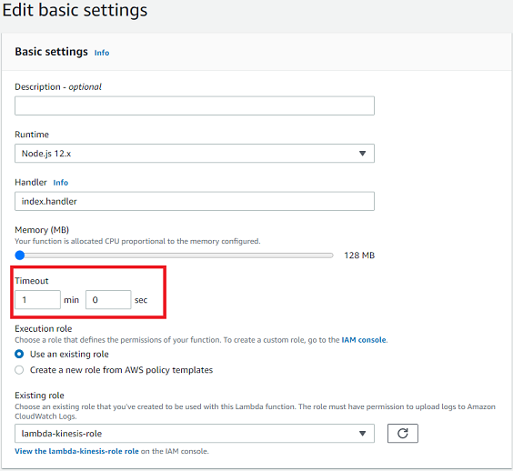

10. From your Lambda function's page, scroll down to the *Function code* section. Select the *Actions tab* and choose **Upload a .zip file**. In the popup, upload the "index.js.zip" from the following folder of the MHMP Project: */backend/Lambdas/MHMP_DataRecord_Processing* 
11. In a duplicate browser tab, navigate to the AWS AppSync Service page in the AWS Console. Click on the API with a name starting with "mhmp". 
12. In the left-hand menu, select **Settings** and take note of the API URL under *API Details*. You will need this URL for the setting the Lambda's enviroment variables in the following steps.
13. In another duplicate browser tab, navigate to the AWS DynamoDB Service page in the AWS Console. In the left-hand menu, click **Tables**. Take note of the following tables startig with "Alert-", "Data-", "Device-", "Location-", and "User-". You will need the full names of these tables for setting the Lambda's enviroment variables in the following steps.
14. From your Lambda function's page, scroll down to the *Environment variables* section and click **Manage environment variables**.
15. Add the following environment variables:
```javascript
   Key: DATA_TABLE          Value: <Full Data Table Name From Step 13>
   Key: DEVICE_TABLE        Value: <Full Device Table Name From Step 13>
   Key: LOCATION_TABLE      Value: <Full Location Table Name From Step 13>
   Key: GRAPHQL_ENDPOINT    Value: <Your AppSync API URL From Step 12>
   ```
16. Click **Save**.

---

### C. Creating an Anomaly Detection Lambda Function

1. Repeat steps **1-6, 8-9, and 11-14 of Part 3.2 B above**. 
2. After finishing step 14 above, add the following environment variables:
```javascript
   Key: DATA_TABLE          Value: <Full Data Table Name From Step 13>
   Key: DEVICE_TABLE        Value: <Full Device Table Name From Step 13>
   Key: USER_TABLE          Value: <Full User Table Name From Step 13>
   Key: GRAPHQL_ENDPOINT    Value: <Your AppSync API URL From Step 12>
   ```
3. Click **Save**.
4. From your Lambda function's page, scroll down to the *Function code* section. Select the *Actions tab* and choose **Upload a .zip file**. In the popup, upload the "index.js.zip" from the following folder of the MHMP Project: */backend/Lambdas/MHMP_AnomalyDetectionHelper* 
5. From your Lambda function's page, in the *Designer* section, click the **Add trigger** button. From the dropdown menu, select **EventBridge (CloudWatch Events)**.
6. Next, under *Rule*, select **Create a new rule**. Enter a *Rule name*. Under *Rule type*, select **Schedule expression**. In the *Schedule expression* field, enter "rate(5 minutes)". Select the *Enable trigger* option then click **Add**.

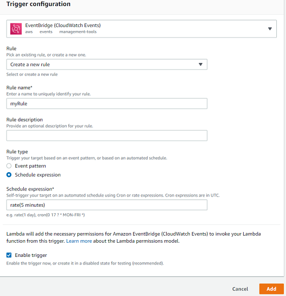

---

### D. Creating a Device Activity Lambda Function

1. Repeat steps **1-6, 8-9, and 11-14 of Part 3.2 B above**. 
2. After finishing step 14 above, add the following environment variables:
```javascript
   Key: DATA_TABLE          Value: <Full Data Table Name From Step 13>
   Key: DEVICE_TABLE        Value: <Full Device Table Name From Step 13>
   Key: GRAPHQL_ENDPOINT    Value: <Your AppSync API URL From Step 12>
   ```
3. Click **Save**.
4. From your Lambda function's page, scroll down to the *Function code* section. Select the *Actions tab* and choose **Upload a .zip file**. In the popup, upload the "index.js.zip" from the following folder of the MHMP Project: */backend/Lambdas/MHMP_DeviceStatusRefresh* 
5. From your Lambda function's page, in the *Designer* section, click the **Add trigger** button. From the dropdown menu, select **EventBridge (CloudWatch Events)**.
6. Next, under *Rule*, select **Create a new rule**. Enter a *Rule name*. Under *Rule type*, select **Schedule expression**. In the *Schedule expression* field, enter "rate(1 hour)". Select the *Enable trigger* option then click **Add**.

